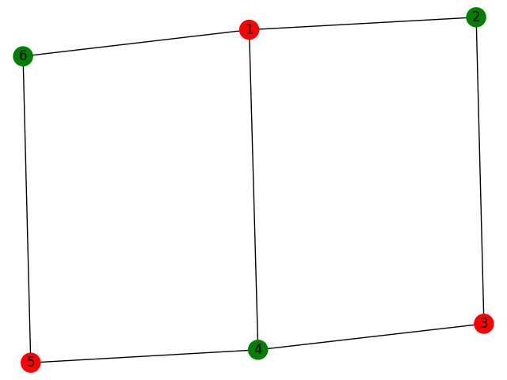

# Bipartite-checker
A simple program that checks whether a graph is bipartite.

## Usage
The usage is demonstrated in the tests. The graph is represented by a list of edges.

```python
from bipartite_checker import Graph, is_bipartite

edge_list = [[1, 2], [2, 3], [3, 1]]

graph = Graph().from_edges(edge_list)

print(is_bipartite(graph))
# output: False
```

The program can be used directly from the console as well.

```shell script
python3 -m check_bipartite 1 2 2 3 3 1
```

Where ```1 2 2 3 3 1``` translates to ```[[1, 2], [2, 3], [3, 1]]```

Optionally it can be used to visualize bipartite coloring using the ```draw_bipartite``` function.

```python
from bipartite_checker import Graph, is_bipartite, draw_bipartite

edge_list = [[1, 2], [2, 3], [3, 4], [4, 1], [4, 5], [5, 6], [1, 6]]

g = Graph().from_edges(edge_list)

draw_bipartite(g)
# output: out.png
```

The output image looks like this:
